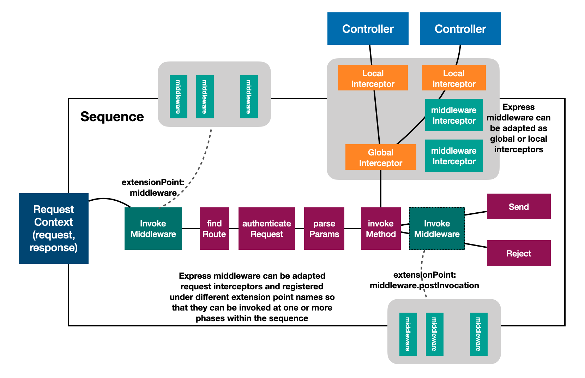

## Overview

Express is the most popular web framework for Node.js developers. As quoted
below from
[Express web site](https://expressjs.com/en/guide/using-middleware.html),
middleware are the basic building blocks for Express applications.

> Express is a routing and middleware web framework that has minimal
> functionality of its own: An Express application is essentially a series of
> middleware function calls.

LookBack 4 leverages Express behind the scenes for its REST server
implementation. We decided to not expose middleware capabilities to users while
we pursue an elegant and non-invasive way to fit Express middleware into the
LoopBack 4 programming model nicely.

There are some gaps in Express middleware that we would like to close to better
align with LoopBack's architecture.

1. Express middleware are one-way handlers that mostly process requests and
   there is no first-class facility to handle responses. We would love to
   support
   [Koa style middleware](https://github.com/koajs/koa/blob/master/docs/guide.md#writing-middleware)
   that use `async/await` to allow cascading behaviors.
2. Express middleware are added by the order of `app.use()` and it's hard to
   contribute middleware from other modules.
3. Express does not allow dependency injection. We would like to enable
   injection of middleware configurations.

To harvest the best of breeds of both frameworks, we build the integration on
top of the [interceptor](Interceptors.md) with community input as illustrated in
the diagram below:



In the diagram, a specialized type of interceptors is introduced as `Middleware`
for LoopBack. Our middleware is basically a function with the signature:

```ts
(context: MiddlewareContext, next: Next) => ValueOrPromise<InvocationResult>;
```

For example, a simple logging middleware can be created and registered as
follows.

```ts
const log: Middleware = async (middlewareCtx, next) => {
  const {request} = middlewareCtx;
  console.log('Request: %s %s', request.method, request.originalUrl);
  try {
    // Proceed with next middleware
    await next();
    // Process response
    console.log(
      'Response received for %s %s',
      request.method,
      request.originalUrl,
    );
  } catch (err) {
    // Catch errors from downstream middleware
    console.error(
      'Error received for %s %s',
      request.method,
      request.originalUrl,
    );
    throw err;
  }
};

server.middleware(log);
```

LoopBack organizes middleware into one or more extension points exposed by
`InvokeMiddleware` providers. Middleware are registered as extensions. Within
the sequence, when `invokeMiddleware` is executed, a chain is formed with
discovered middleware, which are then invoked in a cascading fashion.

The LoopBack global and local interceptors now also serve as a revenue to attach
middleware logic to specific points of controller invocations, such as global,
class, or method levels.

## Bring Express middleware to LoopBack

Express middleware can now be plugged into LoopBack as follows:

- As a `Middleware` to be executed by `InvokeMiddleware` actions within the
  sequence. Middleware are registered by extension points to form chains
  (`MiddlewareChain`).

- As a global or local interceptor for method invocations.

We create a few helper functions to wrap an Express middleware module into an
LoopBack 4 interceptor.

### Create an interceptor from Express middleware factory function

```ts
/**
 * Create an interceptor function from express middleware
 * @param middlewareFactory - Express middleware factory function
 * @param middlewareConfig - Configuration for the middleware
 *
 * @typeParam CFG - Configuration type
 * @typeParam CTX - Context type
 */
export function createInterceptor<CFG, CTX extends Context = InvocationContext>(
  middlewareFactory: ExpressMiddlewareFactory<CFG>,
  middlewareConfig?: CFG,
): GenericInterceptor<CTX> {
  // ...
}
```

If the Express middleware module does not expose a factory function conforming
to `ExpressMiddlewareFactory` signature, a wrapper can be created. For example:

```ts
import morgan from 'morgan';

// Register `morgan` express middleware
// Create a middleware factory wrapper for `morgan(format, options)`
const morganFactory = (config?: morgan.Options) => morgan('combined', config);
```

### Adapt an Express middleware handler function to an interceptor

```ts
/**
 * Wrap an express middleware handler function as an interceptor
 * @param handlerFn - Express middleware handler function
 *
 * @typeParam CTX - Context type
 */
export function toInterceptor<CTX extends Context = InvocationContext>(
  handlerFn: ExpressRequestHandler,
): GenericInterceptor<CTX> {
  // ...
}
```

### Define a provider class for middleware based interceptor

It's often desirable to allow dependency injection of middleware configuration
for the middleware. We can use `defineInterceptorProvider` to simplify
definition of such provider classes.

```ts
/**
 * Define a provider class that wraps the middleware as an interceptor
 * @param middlewareFactory - Middleware factory function
 * @param className - Class name for the generated provider class
 *
 * @typeParam CFG - Configuration type
 * @typeParam CTX - Context type
 */
export function defineInterceptorProvider<
  CFG,
  CTX extends Context = InvocationContext
>(
  middlewareFactory: ExpressMiddlewareFactory<CFG>,
  className?: string,
): Constructor<Provider<GenericInterceptor<CTX>>> {
  // ...
}
```

Alternatively, we can create a subclass of
`ExpressMiddlewareInterceptorProvider`.

```ts
import {config} from '@loopback/context';
import {
  ExpressMiddlewareInterceptorProvider,
  createMiddlewareInterceptorBinding,
} from '@loopback/express';
import spy from 'spy-middleware-module-name-or-path';

class SpyInterceptorProvider extends ExpressMiddlewareInterceptorProvider<
  SpyConfig
> {
  constructor(@config() _spyConfig?: SpyConfig) {
    super(spy, _spyConfig);
  }
}
const binding = createMiddlewareInterceptorBinding(SpyInterceptorProvider);
app.add(binding);
```

### Use middleware as invocation interceptors

With the ability to wrap Express middleware as LoopBack 4 interceptors, we can
use the same programming model to register middleware as global interceptors or
local interceptors denoted by `@intercept` decorators at class and method
levels.

The middleware interceptor function can be directly referenced by `@intercept`.

```ts
import spy from 'spy-middleware-module-name-or-path';
const spyInterceptor = createInterceptor(spy, {action: 'log'});
class MyController {
  @intercept(spyInterceptor)
  hello(msg: string) {
    return `Hello, ${msg}`;
  }
}
```

It's also possible to bind the middleware to a context as a local or global
interceptor.

```ts
const binding = registerExpressMiddlewareInterceptor(
  app,
  spy,
  {action: 'log'},
  {
    // As a global interceptor
    global: true,
  },
);
```

For a bound local interceptor, the binding key can now be used with
`@intercept`.

```ts
@intercept('interceptors.spy')
class MyController {
  hello(msg: string) {
    return `Hello, ${msg}`;
  }
}
```

### Use `lb4 interceptor` command to create middleware interceptors

The `lb4 interceptor` can be used to generate skeleton implementation of global
or local interceptors. We can update the generated code to plug in Express
middleware. For example, to add [helmet](https://github.com/helmetjs/helmet) as
the security middleware:

```sh
lb4 interceptor
? Interceptor name: Helmet
? Is it a global interceptor? Yes
? Group name for the global interceptor: ('') middleware
   create src/interceptors/helmet.interceptor.ts
   update src/interceptors/index.ts

Interceptor Helmet was created in src/interceptors/
```

Let's update `src/interceptors/helmet.interceptor.ts:

```ts
import {config, globalInterceptor} from '@loopback/core';
import helmet, {IHelmetConfiguration} from 'helmet';
import {ExpressMiddlewareInterceptorProvider} from '@loopback/express';

@globalInterceptor('middleware', {tags: {name: 'Helmet'}})
export class MorganInterceptor extends ExpressMiddlewareInterceptorProvider<
  IHelmetConfiguration
> {
  constructor(
    @config()
    options: IHelmetConfiguration = {
      hidePoweredBy: true,
    },
  ) {
    super(helmet, options);
  }
}
```

### Introduce middleware to REST sequence of actions

There are a few actions involved in the default sequence. See `Sequence.md` for
more details.

It's often desirable to reuse Express middleware in the sequence to handle API
requests/responses without reinventing the wheel. We now add an
`InvokeMiddleware` action as the first step in the default sequence. The action
itself is an interceptor chain of `MiddlewareContext`. It uses the powerful
[extension point/extension pattern](Extension-point-and-extensions.md) to
discover registered Express middleware and invoke them as a chain.

#### Register an Express middleware for the sequence

A `middleware` method is added to `RestServer` and `RestApplication` classes to
register Express middleware for middleware actions of the sequence. The
signature is illustrated below.

````ts
/**
 * Bind an Express middleware to this server context
 *
 * @example
 * ```ts
 * server.expressMiddleware(expressExpressMiddlewareFactory, {});
 * ```
 * @param middlewareFactory - Middleware factory function
 * @param middlewareConfig - Middleware config
 * @param options - Options for registration
 *
 * @typeParam CFG - Configuration type
 */
 expressMiddleware<CFG>(
   middlewareFactory: ExpressMiddlewareFactory<CFG>,
   middlewareConfig?: CFG,
   options: MiddlewareBindingOptions = {},
 ): Binding<Middleware> {
   // ...
 }
````

The registration can happen in the constructor of an application.



```ts
import spy from 'spy-middleware-module-name-or-path';
import {ApplicationConfig} from '@loopback/core';
import {RestApplication} from '@loopback/rest';

export class MyApplication extends RestApplication {
  constructor(config: ApplicationConfig) {
    const spyConfig = {action: 'log'};
    this.expressMiddleware(spy, spyConfig, {
      injectConfiguration: true,
      key: 'middleware.spy',
    });
  }
}
```

Middleware based interceptors can also be contributed using components.

```ts
import spy from 'spy-middleware-module-name-or-path';
import {Component} from '@loopback/core';
import {createMiddlewareInterceptorBinding} from '@loopback/express';

export class MyComponent implements Component {
  bindings: [
    createMiddlewareInterceptorBinding(spy),
  ];
}
```

#### Default sequence

The generated `src/sequence.ts` now has a new `middleware` property to
`DefaultSequence` to allow injection of the middleware chain while keeping
backward compatibility of the constructor.



```ts
export class DefaultSequence implements SequenceHandler {
  /**
   * Optional middleware chain
   * Invokes registered middleware (injected via SequenceActions.MIDDLEWARE).
   */
  @inject(SequenceActions.MIDDLEWARE, {optional: true})
  protected invokeMiddleware: InvokeMiddleware = () => {};

  // ...
  async handle(context: RequestContext): Promise<void> {
    try {
      const {request, response} = context;
      await this.invokeMiddleware(context);
      const route = this.findRoute(request);
      const args = await this.parseParams(request, route);
      const result = await this.invoke(route, args);

      debug('%s result -', route.describe(), result);
      this.send(response, result);
    } catch (error) {
      this.reject(context, error);
    }
  }
}
```

#### Extend sequence with more than one middleware actions

Sometimes we want to add middleware to the sequence in between other actions,
for example, do some post-processing before the result is written to the HTTP
response. This can be achieved by overriding the sequence implementation to call
`invokeMiddleware` as needed.



```ts
export class SequenceWithMiddleware extends DefaultSequence {
  async handle(context: RequestContext): Promise<void> {
    try {
      const {request, response} = context;
      // The default middleware chain
      await this.invokeMiddleware(context);
      const route = this.findRoute(request);
      const args = await this.parseParams(request, route);
      const result = await this.invoke(route, args);

      // The second middleware chain for post-invocation processing
      context.bind('invocation.result').to(result);
      // POST_INVOCATION_MIDDLEWARE is the name of the extension point
      // for post-invocation middleware
      await this.invokeMiddleware(context, {
        extensionPoint: POST_INVOCATION_MIDDLEWARE,
      });
      this.send(response, result);
    } catch (error) {
      this.reject(context, error);
    }
  }
}
```

It's also possible to inject multiple instances of `InvokeMiddleware`, each of
which has its own extension point name.



```ts
export class SequenceWithMiddleware extends DefaultSequence {
  /**
   * Optional middleware chain
   * Invokes registered middleware (injected via SequenceActions.MIDDLEWARE).
   */
  @inject('middleware.postInvoke', {optional: true})
  protected middlewarePostInvoke: InvokeMiddleware = () => {};

  async handle(context: RequestContext): Promise<void> {
    try {
      const {request, response} = context;
      // The default middleware chain
      await this.invokeMiddleware(context);
      const route = this.findRoute(request);
      const args = await this.parseParams(request, route);
      const result = await this.invoke(route, args);

      // The second middleware chain for post-invocation processing
      context.bind('invocation.result').to(result);
      await this.middlewarePostInvoke(context);
      this.send(response, result);
    } catch (error) {
      this.reject(context, error);
    }
  }
}
```

Now we can set up applications to leverage the new sequence:



```ts
export class MyApplication extends RestApplication {
  constructor(config: ApplicationConfig) {
    // Create another middleware phase. This is NOT needed if we use the same
    // `invokeMiddleware` with different extension point names.
    this.bind('middleware.postInvoke')
      .toProvider(InvokeMiddlewareProvider)
      .tag({[CoreTags.EXTENSION_POINT]: POST_INVOCATION_MIDDLEWARE});
    this.sequence(SequenceWithMiddleware);

    // Register a middleware
    // `spy` is the factory function of a middleware
    //
    const spyBinding = this.expressMiddleware(spy, undefined, {
      key: 'middleware.spy',
      extensionPointName: POST_INVOCATION_MIDDLEWARE,
    })
      // Set the scope to be `TRANSIENT` so that the new config can be loaded
      .inScope(BindingScope.TRANSIENT);

    this.configure<SpyConfig>(spyBinding.key).to({action: 'log'});
  }
}
```
